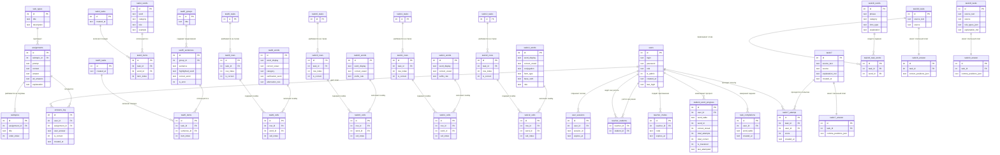

```mermaid
erDiagram

    %% ── Пользователи ─────────────────────────────────────────────

    users {
        int id PK
        text login
        text password
        text role
        int is_admin
        text created_at
        text last_login
    }

    user_sessions {
        int id PK
        int user_id FK
        text session_id
        text expires_at
    }

    teacher_students {
        int teacher_id FK
        int student_id FK
    }

    teacher_invites {
        int id PK
        int teacher_id FK
        text code
        text expires_at
    }

    %% ── Прогресс ──────────────────────────────────────────────────

    student_word_progress {
        int id PK
        int user_id FK
        text word_table
        int word_id
        int correct_streak
        int total_attempts
        int total_correct
        int is_mastered
        text last_attempted
    }

    task_completions {
        int id PK
        int user_id FK
        text word_table
        text created_at
    }

    answers_log {
        int id PK
        int user_id FK
        int assignment_id FK
        text user_answer
        int is_correct
        text created_at
    }

    %% ── Общие задания (не реализованные отдельно) ─────────────────

    task_types {
        int id PK
        text title
        text description
    }

    assignments {
        int id PK
        int subtopic_id FK
        text prompt
        text context
        text answer
        text alt_answers
        text explanation
    }

    subtopics {
        int id PK
        int assignment_id FK
        text title
        int order_index
    }

    %% ── Задание 4: Ударения ───────────────────────────────────────

    task4_words {
        int id PK
        text word
        text category
        text rule
        text example
    }

    task4_tasks {
        int id PK
        text created_at
    }

    task4_items {
        int id PK
        int task_id FK
        int word_id FK
        int item_index
    }

    %% ── Задание 5: Паронимы ───────────────────────────────────────

    task5_groups {
        int id PK
        text title
    }

    task5_sentences {
        int id PK
        int group_id FK
        text sentence
        text highlighted_word
        text correct_word
        int is_error
    }

    task5_tasks {
        int id PK
        text created_at
    }

    task5_items {
        int id PK
        int task_id FK
        int sentence_id FK
        int item_index
    }

    %% ── Задания 9–12: Орфография (единый паттерн) ─────────────────

    task9_words {
        int id PK
        text word_display
        text correct_vowel
        text category
        text verification_word
        text alternation_rule
    }
    task9_tasks { int id PK }
    task9_rows {
        int id PK
        int task_id FK
        int row_index
        int is_correct
    }
    task9_cells {
        int id PK
        int row_id FK
        int word_id FK
        int cell_index
    }

    task10_words {
        int id PK
        text word_display
        text correct_vowel
        text prefix_rule
    }
    task10_tasks { int id PK }
    task10_rows {
        int id PK
        int task_id FK
        int row_index
        int is_correct
    }
    task10_cells {
        int id PK
        int row_id FK
        int word_id FK
        int cell_index
    }

    task11_words {
        int id PK
        text word_display
        text correct_vowel
        text suffix_rule
    }
    task11_tasks { int id PK }
    task11_rows {
        int id PK
        int task_id FK
        int row_index
        int is_correct
    }
    task11_cells {
        int id PK
        int row_id FK
        int word_id FK
        int cell_index
    }

    task12_words {
        int id PK
        text word_display
        text correct_vowel
        text conjugation
        text form_type
        text base_verb
        text rule
    }
    task12_tasks { int id PK }
    task12_rows {
        int id PK
        int task_id FK
        int row_index
        int is_correct
    }
    task12_cells {
        int id PK
        int row_id FK
        int word_id FK
        int cell_index
    }

    %% ── Задание 17: Вводные слова и запятые (интерактив) ──────────

    task17 {
        int id PK
        text source_text
        text source
        text explanation_md
        text created_at
    }

    task17_answer {
        int id PK
        int task_id FK
        text comma_positions_json
    }

    task17_attempt {
        int id PK
        int task_id FK
        int user_id FK
        int score
        text created_at
    }

    %% ── Задание 18: Вводные слова ─────────────────────────────────

    task18_words {
        int id PK
        text phrase
        text category
        text intro_type
        text explanation
    }

    task18_tasks {
        int id PK
        text source_text
        text source
    }

    task18_task_words {
        int id PK
        int task_id FK
        int word_id FK
    }

    task18_answer {
        int id PK
        int task_id FK
        text correct_positions_json
    }

    %% ── Задание 19: Знаки в СПП ───────────────────────────────────

    task19_tasks {
        int id PK
        text source_text
        text source
        text rule_types_json
        text explanation_md
    }

    task19_answer {
        int id PK
        int task_id FK
        text comma_positions_json
    }


    %% ═══════════════════════════════════════════════════════════════
    %% Связи
    %% ═══════════════════════════════════════════════════════════════

    users ||--o{ user_sessions : "открывает сессию"
    users ||--o{ teacher_students : "ведёт как учитель"
    users ||--o{ teacher_students : "учится как ученик"
    users ||--o{ teacher_invites : "создаёт приглашение"
    users ||--o{ student_word_progress : "накапливает прогресс"
    users ||--o{ task_completions : "завершает задание"
    users ||--o{ answers_log : "даёт ответ"
    users ||--o{ task17_attempt : "проходит попытку"

    task_types ||--o{ assignments : "группирует"
    assignments ||--o{ subtopics : "разбивается на подтемы"
    assignments ||--o{ answers_log : "логируется"

    task4_tasks ||--o{ task4_items : "включает позиции"
    task4_words ||--o{ task4_items : "используется в"

    task5_groups ||--o{ task5_sentences : "содержит предложения"
    task5_tasks ||--o{ task5_items : "включает позиции"
    task5_sentences ||--o{ task5_items : "используется в"

    task9_tasks ||--o{ task9_rows : "разбивается на строки"
    task9_rows ||--o{ task9_cells : "содержит ячейки"
    task9_words ||--o{ task9_cells : "заполняет ячейку"

    task10_tasks ||--o{ task10_rows : "разбивается на строки"
    task10_rows ||--o{ task10_cells : "содержит ячейки"
    task10_words ||--o{ task10_cells : "заполняет ячейку"

    task11_tasks ||--o{ task11_rows : "разбивается на строки"
    task11_rows ||--o{ task11_cells : "содержит ячейки"
    task11_words ||--o{ task11_cells : "заполняет ячейку"

    task12_tasks ||--o{ task12_rows : "разбивается на строки"
    task12_rows ||--o{ task12_cells : "содержит ячейки"
    task12_words ||--o{ task12_cells : "заполняет ячейку"

    task17 ||--|| task17_answer : "имеет эталонный ответ"
    task17 ||--o{ task17_attempt : "проходится в попытках"

    task18_tasks ||--o{ task18_task_words : "привязывает слова"
    task18_words ||--o{ task18_task_words : "входит в задание"
    task18_tasks ||--|| task18_answer : "имеет эталонный ответ"

    task19_tasks ||--|| task19_answer : "имеет эталонный ответ"
```
